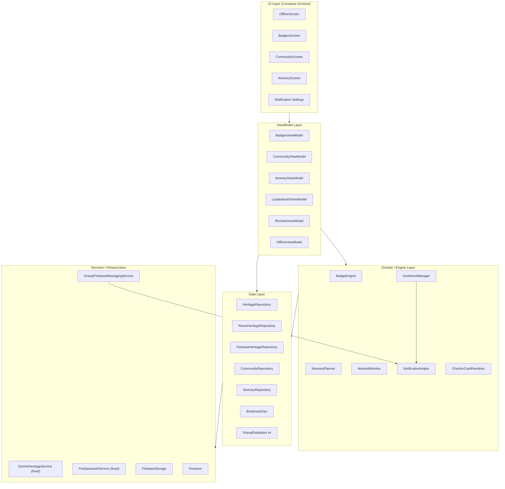

# Design Document — Virasat Heritage App (Requirements 6–11)

## Overview

This document covers the technical design for the six new feature areas added to the Virasat Android heritage app (Requirements 6–11). Requirements 1–5 (auth, onboarding, language selection, biometric) are already implemented and are not redesigned here.

The six feature areas are:

| # | Feature | Requirement |
|---|---------|-------------|
| 1 | Critical Bug Fixes | Req 6 |
| 2 | Offline Mode & Bookmarks | Req 7 |
| 3 | Smart Badges & Gamification Engine | Req 8 |
| 4 | Push Notifications & Geofencing | Req 9 |
| 5 | Social Sharing & Community | Req 10 |
| 6 | Itinerary Planner | Req 11 |

### Scope Boundaries

- No new third-party libraries are introduced beyond `firebase-messaging-ktx` and `firebase-storage-ktx` (both already on the Firebase BOM).
- All new ViewModels follow the existing `AndroidViewModel` + `RepositoryProvider` pattern already established in `HomeViewModel`.
- The Room database version is bumped from 3 to 4 with an explicit migration for the new `bookmarks` table.
- Property-based tests use the **Kotest Property** library (`io.kotest:kotest-property-jvm`), which is the idiomatic Kotlin PBT library and requires no Android runtime.

---

## Architecture

The app follows a single-activity MVVM architecture with Jetpack Compose UI, a `HeritageRepository` interface as the data boundary, and Firebase + Room as dual data sources. The diagram below shows how the six new feature areas slot into the existing layers.



### Key Architectural Decisions

1. **`BadgeEngine` as a pure object** — `BadgeEngine.evaluate()` takes only value types (lists of check-ins, facts, quiz results, a boolean) and returns a list of `BadgeResult`. No side effects, no coroutines. This makes it trivially testable and deterministic.

2. **`ItineraryPlanner` as a pure object** — `nearestNeighbour()` and `haversineDistance()` are pure functions operating on `HeritageSite` data classes. No I/O, no state.

3. **`CommunityRepository` is separate from `HeritageRepository`** — Community posts and reviews are a distinct Firestore sub-domain. Mixing them into `HeritageRepository` would bloat the interface. `CommunityRepository` is injected directly into its ViewModels.

4. **`ItineraryRepository` is separate from `HeritageRepository`** — Itineraries live under `users/{uid}/itineraries` in Firestore, a user-scoped sub-collection. Keeping it separate avoids coupling user-specific write operations into the shared read-oriented `HeritageRepository`.

5. **`NetworkMonitor` wraps `ConnectivityManager.NetworkCallback`** — Exposes a `StateFlow<Boolean>` (`isOnline`) so any ViewModel can observe connectivity without Android framework coupling in the ViewModel itself.

6. **Room v4 migration** — Only adds the `bookmarks` table. Uses `Migration(3, 4)` with a single `CREATE TABLE` statement rather than `fallbackToDestructiveMigration`, preserving existing check-in and unlocked-fact data.

---

## Components and Interfaces

### Feature 1 — Critical Bug Fixes (Requirement 6)

#### 1.1 `GeminiHeritageService` — Remove Certificate Pinner

The existing `client` field in `GeminiHeritageService` includes a `CertificatePinner` with a placeholder SHA-256 pin that causes all HTTPS calls to `generativelanguage.googleapis.com` to fail with an `SSLPeerUnverifiedException`. The fix removes the `.certificatePinner(...)` call entirely, relying on the Android system trust store.

```kotlin
// BEFORE (broken)
private val client = OkHttpClient.Builder()
    .connectTimeout(30, TimeUnit.SECONDS)
    .readTimeout(60, TimeUnit.SECONDS)
    .writeTimeout(60, TimeUnit.SECONDS)
    .certificatePinner(
        CertificatePinner.Builder()
            .add("generativelanguage.googleapis.com", "sha256/AAAA...=")
            .build()
    )
    .build()

// AFTER (fixed)
private val client = OkHttpClient.Builder()
    .connectTimeout(30, TimeUnit.SECONDS)
    .readTimeout(60, TimeUnit.SECONDS)
    .writeTimeout(60, TimeUnit.SECONDS)
    .build()
```

#### 1.2 `GeminiHeritageService` — Fix Prompt Injection in `callGemini`

The existing `callGemini` builds the JSON payload via string interpolation (`"$prompt"`), which breaks if `prompt` contains double quotes, backslashes, or newlines. The fix uses `org.json.JSONObject` (already on the classpath via the Android SDK) to construct the payload safely.

```kotlin
// AFTER (fixed) — structured JSON construction
private suspend fun callGemini(prompt: String, model: String = "gemini-2.0-flash"): String =
    withContext(Dispatchers.IO) {
        if (!isInitialized()) return@withContext ""
        try {
            val part = JSONObject().put("text", prompt)
            val parts = org.json.JSONArray().put(part)
            val content = JSONObject().put("parts", parts)
            val contents = org.json.JSONArray().put(content)
            val payload = JSONObject().put("contents", contents).toString()

            val requestBody = payload.toRequestBody("application/json".toMediaType())
            val request = Request.Builder()
                .url("https://generativelanguage.googleapis.com/v1beta/models/$model:generateContent?key=$apiKey")
                .post(requestBody)
                .build()
            // ... response parsing unchanged
        } catch (_: Exception) { "" }
    }
```

#### 1.3 `MainActivity` — Reactive Auth State

The existing code reads `FirebaseAuthService.isLoggedIn` once at composition time via `remember { ... }`, so sign-out does not trigger recomposition. The fix collects `authStateFlow()` as Compose state.

```kotlin
// AFTER (fixed) — reactive auth state
val authUser by FirebaseAuthService.authStateFlow()
    .collectAsState(initial = FirebaseAuthService.currentUser)

val startDest = when {
    !onboardingSeen -> "splash"
    authUser == null -> "login"
    else -> "home"
}
```

A `LaunchedEffect(authUser)` block handles mid-session sign-out by navigating to `"login"` and clearing the back stack when `authUser` becomes `null` after the initial composition.

#### 1.4 `Fact` Data Class — `@Serializable` Annotation

The `Fact` data class in `HeritageSite.kt` is used by `Converters.toFactList` / `fromFactList` via `kotlinx.serialization`, but is missing the `@Serializable` annotation, causing a runtime crash. The fix adds the annotation and `@SerialName` annotations to guard against field-name refactoring.

```kotlin
// AFTER (fixed)
@kotlinx.serialization.Serializable
data class Fact(
    @kotlinx.serialization.SerialName("id")    val id: String,
    @kotlinx.serialization.SerialName("title") val title: String,
    @kotlinx.serialization.SerialName("desc")  val description: String,
    @kotlinx.serialization.SerialName("unlocked") val isUnlocked: Boolean = false
)
```

---

### Feature 2 — Offline Mode & Bookmarks (Requirement 7)

#### 2.1 `BookmarkEntity` — Room Table

```kotlin
@Entity(tableName = "bookmarks")
data class BookmarkEntity(
    @PrimaryKey val siteId: String,
    val bookmarkedAt: Long = System.currentTimeMillis()
)
```

#### 2.2 `BookmarkDao`

```kotlin
@Dao
interface BookmarkDao {
    @Insert(onConflict = OnConflictStrategy.REPLACE)
    suspend fun insert(bookmark: BookmarkEntity)

    @Query("DELETE FROM bookmarks WHERE siteId = :siteId")
    suspend fun delete(siteId: String)

    @Query("SELECT EXISTS(SELECT 1 FROM bookmarks WHERE siteId = :siteId)")
    suspend fun exists(siteId: String): Boolean

    @Query("SELECT siteId FROM bookmarks ORDER BY bookmarkedAt DESC")
    fun observeAll(): Flow<List<String>>
}
```

#### 2.3 `RoomHeritageRepository` — Bookmark Implementation

The existing stub methods are replaced with real `BookmarkDao` calls:

```kotlin
override suspend fun toggleBookmark(siteId: String): Boolean {
    return if (bookmarkDao.exists(siteId)) {
        bookmarkDao.delete(siteId)
        false
    } else {
        bookmarkDao.insert(BookmarkEntity(siteId))
        true
    }
}

override suspend fun isBookmarked(siteId: String): Boolean =
    bookmarkDao.exists(siteId)

override fun observeBookmarks(): Flow<List<String>> =
    bookmarkDao.observeAll()
```

#### 2.4 `NetworkMonitor`

```kotlin
class NetworkMonitor(context: Context) {
    private val connectivityManager =
        context.getSystemService(Context.CONNECTIVITY_SERVICE) as ConnectivityManager

    private val _isOnline = MutableStateFlow(isCurrentlyOnline())
    val isOnline: StateFlow<Boolean> = _isOnline.asStateFlow()

    private val callback = object : ConnectivityManager.NetworkCallback() {
        override fun onAvailable(network: Network) { _isOnline.value = true }
        override fun onLost(network: Network)      { _isOnline.value = false }
    }

    fun register() {
        val request = NetworkRequest.Builder()
            .addCapability(NetworkCapabilities.NET_CAPABILITY_INTERNET)
            .build()
        connectivityManager.registerNetworkCallback(request, callback)
    }

    fun unregister() = connectivityManager.unregisterNetworkCallback(callback)

    private fun isCurrentlyOnline(): Boolean {
        val network = connectivityManager.activeNetwork ?: return false
        val caps = connectivityManager.getNetworkCapabilities(network) ?: return false
        return caps.hasCapability(NetworkCapabilities.NET_CAPABILITY_INTERNET)
    }
}
```

`NetworkMonitor` is instantiated in `VirasatApplication` and exposed as a singleton so ViewModels can inject it via `RepositoryProvider`.

#### 2.5 Bookmark Sync (Online → Room)

`BookmarkSyncWorker` (a `CoroutineWorker`) runs when the device comes online. It fetches the `bookmarks` array from `users/{uid}` in Firestore and upserts each `siteId` into the local `BookmarkDao`. This is triggered from `NetworkMonitor.isOnline` collector in `OfflineViewModel`.

```kotlin
// In OfflineViewModel
viewModelScope.launch {
    networkMonitor.isOnline
        .filter { it }
        .collect { syncBookmarksFromFirestore() }
}

private suspend fun syncBookmarksFromFirestore() {
    val uid = FirebaseAuthService.uid ?: return
    val doc = FirebaseFirestore.getInstance()
        .collection("users").document(uid).get().await()
    val remoteIds = doc.get("bookmarks") as? List<*> ?: return
    remoteIds.filterIsInstance<String>().forEach { siteId ->
        bookmarkDao.insert(BookmarkEntity(siteId))
    }
}
```

#### 2.6 `OfflineScreen`

`OfflineScreen` observes `NetworkMonitor.isOnline` and `repository.observeBookmarks()`. When offline, it loads full `HeritageSite` objects from Room for each bookmarked `siteId` and displays them in a `LazyColumn`. Tapping a card navigates to `site_detail/{siteId}`.

#### 2.7 Coil Disk Cache Configuration

In `VirasatApplication.onCreate()`:

```kotlin
val imageLoader = ImageLoader.Builder(this)
    .diskCache {
        DiskCache.Builder()
            .directory(cacheDir.resolve("image_cache"))
            .maxSizePercent(0.05)
            .build()
    }
    .diskCachePolicy(CachePolicy.ENABLED)
    .memoryCachePolicy(CachePolicy.ENABLED)
    .build()
Coil.setImageLoader(imageLoader)
```

#### 2.8 `VirasatDatabase` — Version 4 Migration

```kotlin
@Database(
    entities = [HeritageSiteEntity::class, CheckIn::class, UnlockedFact::class, BookmarkEntity::class],
    version = 4,
    exportSchema = false
)
// ...

val MIGRATION_3_4 = object : Migration(3, 4) {
    override fun migrate(database: SupportSQLiteDatabase) {
        database.execSQL(
            "CREATE TABLE IF NOT EXISTS bookmarks " +
            "(siteId TEXT NOT NULL PRIMARY KEY, bookmarkedAt INTEGER NOT NULL DEFAULT 0)"
        )
    }
}
```

`Room.databaseBuilder(...)` receives `.addMigrations(MIGRATION_3_4)` instead of `.fallbackToDestructiveMigration()`.


---

### Feature 3 — Smart Badges (Requirement 8)

#### 3.1 `BadgeCondition` Sealed Class

```kotlin
sealed class BadgeCondition {
    data class TempleCheckIns(val required: Int) : BadgeCondition()
    data class FactsUnlocked(val required: Int) : BadgeCondition()
    object UnescoCheckIn : BadgeCondition()
    data class UniqueCheckIns(val required: Int) : BadgeCondition()
    object QuizPerfect : BadgeCondition()
    object AiTourUsed : BadgeCondition()
}
```

#### 3.2 `BadgeDefinition` Data Class

```kotlin
data class BadgeDefinition(
    val id: String,
    val name: String,
    val description: String,
    val icon: androidx.compose.ui.graphics.vector.ImageVector,
    val condition: BadgeCondition
)

// Catalogue (singleton)
object BadgeCatalogue {
    val all: List<BadgeDefinition> = listOf(
        BadgeDefinition("temple_seeker",  "Temple Seeker",  "Check in at 3 temples",          Icons.Default.TempleHindu, BadgeCondition.TempleCheckIns(3)),
        BadgeDefinition("fact_collector", "Fact Collector", "Unlock 5 facts",                  Icons.Default.Lightbulb,   BadgeCondition.FactsUnlocked(5)),
        BadgeDefinition("unesco_explorer","UNESCO Explorer","Check in at a UNESCO site",        Icons.Default.Public,      BadgeCondition.UnescoCheckIn),
        BadgeDefinition("pathfinder",     "Pathfinder",     "Check in at 5 unique sites",       Icons.Default.Map,         BadgeCondition.UniqueCheckIns(5)),
        BadgeDefinition("quiz_master",    "Quiz Master",    "Score 100% on a quiz",             Icons.Default.Star,        BadgeCondition.QuizPerfect),
        BadgeDefinition("ai_voyager",     "AI Voyager",     "Use the AI Tour for any site",     Icons.Default.SmartToy,    BadgeCondition.AiTourUsed)
    )
}
```

#### 3.3 `BadgeResult` Data Class

```kotlin
data class BadgeResult(
    val definition: BadgeDefinition,
    val isUnlocked: Boolean,
    val progress: Int,   // current count toward threshold
    val target: Int      // threshold (1 for boolean conditions)
)
```

#### 3.4 `BadgeEngine` Object

`BadgeEngine.evaluate` is a pure function — no coroutines, no I/O, no side effects.

```kotlin
object BadgeEngine {
    fun evaluate(
        checkIns: List<CheckIn>,
        unlockedFacts: List<UnlockedFact>,
        quizResults: List<QuizResult>,   // data class: siteId, score (0–100)
        aiTourUsed: Boolean
    ): List<BadgeResult> {
        val templeCount   = checkIns.count { it.stampIcon == "temple" }
        val uniqueCount   = checkIns.map { it.siteId }.distinct().size
        val unescoVisited = checkIns.any { it.stampIcon == "unesco" }
        val factCount     = unlockedFacts.size
        val perfectQuiz   = quizResults.any { it.score == 100 }

        return BadgeCatalogue.all.map { def ->
            when (val cond = def.condition) {
                is BadgeCondition.TempleCheckIns  -> BadgeResult(def, templeCount >= cond.required,  templeCount,  cond.required)
                is BadgeCondition.FactsUnlocked   -> BadgeResult(def, factCount   >= cond.required,  factCount,    cond.required)
                is BadgeCondition.UnescoCheckIn   -> BadgeResult(def, unescoVisited,                 if (unescoVisited) 1 else 0, 1)
                is BadgeCondition.UniqueCheckIns  -> BadgeResult(def, uniqueCount  >= cond.required,  uniqueCount,  cond.required)
                is BadgeCondition.QuizPerfect     -> BadgeResult(def, perfectQuiz,                   if (perfectQuiz) 1 else 0, 1)
                is BadgeCondition.AiTourUsed      -> BadgeResult(def, aiTourUsed,                    if (aiTourUsed) 1 else 0, 1)
            }
        }
    }
}
```

#### 3.5 `BadgesViewModel`

```kotlin
class BadgesViewModel(application: Application) : AndroidViewModel(application) {
    private val repo = RepositoryProvider.getRepository(application)

    private val _badges = MutableStateFlow<List<BadgeResult>>(emptyList())
    val badges: StateFlow<List<BadgeResult>> = _badges.asStateFlow()

    init {
        viewModelScope.launch {
            combine(
                repo.getAllCheckIns(),
                repo.getAllUnlockedFacts()
            ) { checkIns, facts ->
                // quizResults and aiTourUsed sourced from SharedPreferences / Firestore
                val quizResults = loadQuizResults()
                val aiTourUsed  = loadAiTourUsed()
                BadgeEngine.evaluate(checkIns, facts, quizResults, aiTourUsed)
            }.collect { _badges.value = it }
        }
    }
}
```

#### 3.6 `BadgesScreen` — Updated

The existing `BadgesScreen` is refactored to consume `BadgesViewModel` via `viewModel()`. Locked badges show a `LinearProgressIndicator` with `progress / target` ratio and a label `"${result.progress} / ${result.target}"`. Newly unlocked badges (detected by comparing previous state) trigger a `Snackbar` congratulatory message.

---

### Feature 4 — Push Notifications (Requirement 9)

#### 4.1 `VirasatFirebaseMessagingService`

```kotlin
class VirasatFirebaseMessagingService : FirebaseMessagingService() {

    override fun onNewToken(token: String) {
        val uid = FirebaseAuthService.uid ?: return
        FirebaseFirestore.getInstance()
            .collection("users").document(uid)
            .update("fcmToken", token)
    }

    override fun onMessageReceived(message: RemoteMessage) {
        val title = message.notification?.title ?: message.data["title"] ?: return
        val body  = message.notification?.body  ?: message.data["body"]  ?: ""
        val deepLink = message.data["deepLink"]
        NotificationHelper.showRemoteNotification(this, title, body, deepLink)
    }
}
```

Registered in `AndroidManifest.xml` with `<intent-filter>` for `com.google.firebase.MESSAGING_EVENT`.

#### 4.2 `NotificationHelper`

Creates three notification channels on first call (API 26+):

| Channel ID | Name | Importance |
|---|---|---|
| `virasat_proximity` | Nearby Heritage Sites | HIGH |
| `virasat_weekly` | Weekly Heritage Facts | DEFAULT |
| `virasat_badges` | Badge Unlocks | DEFAULT |

```kotlin
object NotificationHelper {
    fun createChannels(context: Context) { /* ... */ }

    fun showProximityNotification(context: Context, siteName: String, siteId: String) {
        if (!NotificationPreferences.isEnabled(context, "proximity")) return
        val intent = Intent(Intent.ACTION_VIEW, "virasat://site/$siteId".toUri())
        // build and show NotificationCompat with PendingIntent
    }

    fun showBadgeNotification(context: Context, badgeName: String) {
        if (!NotificationPreferences.isEnabled(context, "badges")) return
        val intent = Intent(Intent.ACTION_VIEW, "virasat://badges".toUri())
        // build and show NotificationCompat
    }

    fun showRemoteNotification(context: Context, title: String, body: String, deepLink: String?) {
        // build and show NotificationCompat with optional deep link PendingIntent
    }
}
```

#### 4.3 `GeofenceManager`

```kotlin
class GeofenceManager(private val context: Context) {
    private val client: GeofencingClient = LocationServices.getGeofencingClient(context)

    fun registerAll(sites: List<HeritageSite>) {
        val geofences = sites.map { site ->
            Geofence.Builder()
                .setRequestId(site.id)
                .setCircularRegion(site.latitude, site.longitude, 500f)
                .setExpirationDuration(Geofence.NEVER_EXPIRE)
                .setTransitionTypes(Geofence.GEOFENCE_TRANSITION_ENTER)
                .build()
        }
        val request = GeofencingRequest.Builder()
            .setInitialTrigger(GeofencingRequest.INITIAL_TRIGGER_ENTER)
            .addGeofences(geofences)
            .build()
        client.addGeofences(request, geofencePendingIntent)
    }

    private val geofencePendingIntent: PendingIntent by lazy {
        val intent = Intent(context, GeofenceBroadcastReceiver::class.java)
        PendingIntent.getBroadcast(context, 0, intent,
            PendingIntent.FLAG_UPDATE_CURRENT or PendingIntent.FLAG_MUTABLE)
    }
}
```

`GeofenceBroadcastReceiver` handles `GeofencingEvent` and calls `NotificationHelper.showProximityNotification`. If the device is offline at trigger time, the notification is queued in a `WorkManager` `OneTimeWorkRequest` with a `NetworkType.CONNECTED` constraint.

#### 4.4 `NotificationPreferences`

```kotlin
object NotificationPreferences {
    private const val PREFS = "notification_prefs"

    fun isEnabled(context: Context, category: String): Boolean =
        context.getSharedPreferences(PREFS, Context.MODE_PRIVATE)
            .getBoolean(category, true)

    fun setEnabled(context: Context, category: String, enabled: Boolean) =
        context.getSharedPreferences(PREFS, Context.MODE_PRIVATE)
            .edit().putBoolean(category, enabled).apply()
}
```

#### 4.5 Deep Link Handling

`AndroidManifest.xml` — add to `MainActivity` `<activity>`:

```xml
<intent-filter android:autoVerify="true">
    <action android:name="android.intent.action.VIEW" />
    <category android:name="android.intent.category.DEFAULT" />
    <category android:name="android.intent.category.BROWSABLE" />
    <data android:scheme="virasat" />
</intent-filter>
```

`MainActivity.onCreate` inspects `intent.data` and navigates accordingly:

```kotlin
intent?.data?.let { uri ->
    when {
        uri.host == "site"      -> navController.navigate("site_detail/${uri.lastPathSegment}")
        uri.host == "badges"    -> navController.navigate("badges")
        uri.host == "itinerary" -> navController.navigate("itinerary/${uri.lastPathSegment}")
    }
}
```

`POST_NOTIFICATIONS` permission is requested in `MainActivity` via `ActivityResultContracts.RequestPermission` before `NotificationHelper.createChannels` is called.


---

### Feature 5 — Social Sharing & Community (Requirement 10)

#### 5.1 `CommunityPost` Data Class

```kotlin
data class CommunityPost(
    val id: String = "",
    val userId: String = "",
    val userName: String = "",
    val siteId: String = "",
    val siteName: String = "",
    val imageUrl: String? = null,
    val text: String = "",
    val timestamp: com.google.firebase.Timestamp? = null
)
```

#### 5.2 `CommunityRepository`

```kotlin
class CommunityRepository {
    private val db = FirebaseFirestore.getInstance()
    private val storage = FirebaseStorage.getInstance()

    fun observePosts(): Flow<List<CommunityPost>> = callbackFlow {
        val listener = db.collection("communityPosts")
            .orderBy("timestamp", Query.Direction.DESCENDING)
            .addSnapshotListener { snap, _ ->
                val posts = snap?.documents?.mapNotNull { it.toObject(CommunityPost::class.java)?.copy(id = it.id) }
                trySend(posts ?: emptyList())
            }
        awaitClose { listener.remove() }
    }

    suspend fun submitPost(post: CommunityPost, photoBitmap: Bitmap? = null) {
        val imageUrl = photoBitmap?.let { uploadPhoto(it, post.userId) }
        val doc = mapOf(
            "userId"    to post.userId,
            "userName"  to post.userName,
            "siteId"    to post.siteId,
            "siteName"  to post.siteName,
            "imageUrl"  to imageUrl,
            "text"      to post.text,
            "timestamp" to FieldValue.serverTimestamp()
        )
        db.collection("communityPosts").add(doc).await()
    }

    private suspend fun uploadPhoto(bitmap: Bitmap, userId: String): String {
        val ref = storage.reference.child("community/$userId/${UUID.randomUUID()}.jpg")
        val stream = ByteArrayOutputStream()
        bitmap.compress(Bitmap.CompressFormat.JPEG, 85, stream)
        ref.putBytes(stream.toByteArray()).await()
        return ref.downloadUrl.await().toString()
    }
}
```

#### 5.3 `CommunityViewModel`

```kotlin
class CommunityViewModel(application: Application) : AndroidViewModel(application) {
    private val communityRepo = CommunityRepository()

    val posts: StateFlow<List<CommunityPost>> =
        communityRepo.observePosts()
            .stateIn(viewModelScope, SharingStarted.WhileSubscribed(5_000), emptyList())

    fun submitPost(post: CommunityPost, photoBitmap: Bitmap? = null) {
        viewModelScope.launch {
            communityRepo.submitPost(post, photoBitmap)
        }
    }
}
```

#### 5.4 `CommunityScreen` — Updated

The existing `CommunityScreen` is refactored to consume `CommunityViewModel`. A `FloatingActionButton` opens a bottom sheet for composing a new post. Empty state (no posts) shows an invitation card. The existing `CommunityPost` local data class is replaced by the domain model above.

#### 5.5 Check-In Card Sharing — `CheckInCardRenderer`

```kotlin
@Composable
fun CheckInCardRenderer(
    site: HeritageSite,
    userName: String,
    modifier: Modifier = Modifier
): Bitmap {
    // Renders a 1080x1080 card with site image, stamp icon, site name, user name
    // Returns bitmap via drawToBitmap() on the underlying View
}

fun shareCheckInCard(context: Context, bitmap: Bitmap) {
    val file = File(context.cacheDir, "checkin_share.jpg")
    file.outputStream().use { bitmap.compress(Bitmap.CompressFormat.JPEG, 90, it) }
    val uri = FileProvider.getUriForFile(context, "${context.packageName}.fileprovider", file)
    val intent = Intent(Intent.ACTION_SEND).apply {
        type = "image/jpeg"
        putExtra(Intent.EXTRA_STREAM, uri)
        addFlags(Intent.FLAG_GRANT_READ_URI_PERMISSION)
    }
    context.startActivity(Intent.createChooser(intent, "Share your check-in"))
}
```

`FileProvider` is declared in `AndroidManifest.xml` with `android:authorities="${applicationId}.fileprovider"`.

#### 5.6 `ReviewsViewModel`

```kotlin
class ReviewsViewModel(application: Application) : AndroidViewModel(application) {
    private val db = FirebaseFirestore.getInstance()
    private val storage = FirebaseStorage.getInstance()

    fun submitReview(siteId: String, text: String, photoBitmap: Bitmap?) {
        require(text.length in 1..500) { "Review must be 1–500 characters" }
        viewModelScope.launch {
            val imageUrl = photoBitmap?.let { uploadReviewPhoto(it, siteId) }
            val uid = FirebaseAuthService.uid ?: return@launch
            db.collection("heritageSites").document(siteId)
                .collection("reviews")
                .add(mapOf(
                    "userId"    to uid,
                    "text"      to text,
                    "imageUrl"  to imageUrl,
                    "timestamp" to FieldValue.serverTimestamp()
                )).await()
        }
    }

    private suspend fun uploadReviewPhoto(bitmap: Bitmap, siteId: String): String {
        val ref = storage.reference.child("reviews/$siteId/${UUID.randomUUID()}.jpg")
        val stream = ByteArrayOutputStream()
        bitmap.compress(Bitmap.CompressFormat.JPEG, 85, stream)
        ref.putBytes(stream.toByteArray()).await()
        return ref.downloadUrl.await().toString()
    }
}
```

#### 5.7 `LeaderboardViewModel`

```kotlin
class LeaderboardViewModel(application: Application) : AndroidViewModel(application) {
    private val db = FirebaseFirestore.getInstance()

    val leaderboard: StateFlow<List<LeaderboardEntry>> = callbackFlow {
        val listener = db.collection("users")
            .orderBy("checkInCount", Query.Direction.DESCENDING)
            .limit(50)
            .addSnapshotListener { snap, _ ->
                val entries = snap?.documents?.mapNotNull { doc ->
                    LeaderboardEntry(
                        uid       = doc.id,
                        name      = doc.getString("name") ?: "",
                        checkIns  = (doc.getLong("checkInCount") ?: 0).toInt(),
                        badges    = (doc.getLong("badgesEarned") ?: 0).toInt()
                    )
                }
                trySend(entries ?: emptyList())
            }
        awaitClose { listener.remove() }
    }.stateIn(viewModelScope, SharingStarted.WhileSubscribed(5_000), emptyList())

    val currentUid: String? get() = FirebaseAuthService.uid
}

data class LeaderboardEntry(val uid: String, val name: String, val checkIns: Int, val badges: Int)
```

The existing `LeaderboardScreen` is refactored to consume `LeaderboardViewModel`. The current user's row is highlighted when `entry.uid == viewModel.currentUid`.

---

### Feature 6 — Itinerary Planner (Requirement 11)

#### 6.1 `Itinerary` Data Class

```kotlin
data class Itinerary(
    val id: String = "",
    val name: String = "",
    val siteIds: List<String> = emptyList(),
    val createdAt: Long = System.currentTimeMillis()
)
```

#### 6.2 `ItineraryRepository`

```kotlin
class ItineraryRepository {
    private val db = FirebaseFirestore.getInstance()

    private fun collection() = db.collection("users")
        .document(FirebaseAuthService.uid ?: "anon")
        .collection("itineraries")

    suspend fun save(itinerary: Itinerary): String {
        val doc = if (itinerary.id.isBlank()) collection().document()
                  else collection().document(itinerary.id)
        doc.set(itinerary).await()
        return doc.id
    }

    fun observeAll(): Flow<List<Itinerary>> = callbackFlow {
        val listener = collection()
            .orderBy("createdAt", Query.Direction.DESCENDING)
            .addSnapshotListener { snap, _ ->
                val list = snap?.documents?.mapNotNull { doc ->
                    doc.toObject(Itinerary::class.java)?.copy(id = doc.id)
                }
                trySend(list ?: emptyList())
            }
        awaitClose { listener.remove() }
    }

    suspend fun getById(id: String): Itinerary? =
        collection().document(id).get().await()
            .toObject(Itinerary::class.java)?.copy(id = id)

    suspend fun delete(id: String) = collection().document(id).delete().await()
}
```

#### 6.3 `ItineraryPlanner` Object

```kotlin
object ItineraryPlanner {

    fun nearestNeighbour(sites: List<HeritageSite>): List<HeritageSite> {
        if (sites.size < 2) return sites
        val remaining = sites.toMutableList()
        val ordered   = mutableListOf(remaining.removeAt(0))
        while (remaining.isNotEmpty()) {
            val last    = ordered.last()
            val nearest = remaining.minByOrNull { haversineDistance(last.latitude, last.longitude, it.latitude, it.longitude) }!!
            ordered.add(nearest)
            remaining.remove(nearest)
        }
        return ordered
    }

    fun haversineDistance(lat1: Double, lon1: Double, lat2: Double, lon2: Double): Double {
        val R = 6371.0 // Earth radius in km
        val dLat = Math.toRadians(lat2 - lat1)
        val dLon = Math.toRadians(lon2 - lon1)
        val a = sin(dLat / 2).pow(2) +
                cos(Math.toRadians(lat1)) * cos(Math.toRadians(lat2)) * sin(dLon / 2).pow(2)
        return R * 2 * asin(sqrt(a))
    }

    fun totalDistance(sites: List<HeritageSite>): Double =
        sites.zipWithNext().sumOf { (a, b) ->
            haversineDistance(a.latitude, a.longitude, b.latitude, b.longitude)
        }
}
```

#### 6.4 `ItineraryViewModel`

```kotlin
class ItineraryViewModel(application: Application) : AndroidViewModel(application) {
    private val repo = RepositoryProvider.getRepository(application)
    private val itineraryRepo = ItineraryRepository()

    val savedItineraries: StateFlow<List<Itinerary>> =
        itineraryRepo.observeAll()
            .stateIn(viewModelScope, SharingStarted.WhileSubscribed(5_000), emptyList())

    private val _currentSites = MutableStateFlow<List<HeritageSite>>(emptyList())
    val orderedSites: StateFlow<List<HeritageSite>> = _currentSites.asStateFlow()

    fun addSite(site: HeritageSite) {
        _currentSites.value = ItineraryPlanner.nearestNeighbour(_currentSites.value + site)
    }

    fun removeSite(siteId: String) {
        _currentSites.value = ItineraryPlanner.nearestNeighbour(
            _currentSites.value.filter { it.id != siteId }
        )
    }

    fun saveItinerary(name: String) {
        viewModelScope.launch {
            val itinerary = Itinerary(
                name    = name,
                siteIds = _currentSites.value.map { it.id }
            )
            itineraryRepo.save(itinerary)
        }
    }

    fun exportDeepLink(itineraryId: String): String = "virasat://itinerary/$itineraryId"

    fun loadItinerary(id: String) {
        viewModelScope.launch {
            val itinerary = itineraryRepo.getById(id) ?: return@launch
            val sites = itinerary.siteIds.mapNotNull { repo.getSiteById(it) }
            _currentSites.value = sites
        }
    }
}
```

#### 6.5 `ItineraryScreen` — Updated

The existing `ItineraryScreen` (which uses hardcoded data) is refactored to consume `ItineraryViewModel`. Key UI elements:

- **Search bar** — calls `repo.searchSites(query)` and shows results in a dropdown; tapping a result calls `viewModel.addSite(site)`.
- **Ordered list** — `LazyColumn` of `TimelineRow` items showing site name, location, and distance to next site (from `ItineraryPlanner.haversineDistance`).
- **Save dialog** — `AlertDialog` with a `TextField` for the itinerary name; calls `viewModel.saveItinerary(name)`.
- **Export button** — calls `viewModel.exportDeepLink(id)` and invokes `Intent.ACTION_SEND` with the URL string.
- **Saved itineraries** — `FilterChip` row at the top; selecting a chip calls `viewModel.loadItinerary(id)`.

#### 6.6 Deep Link for Itinerary

The `virasat://itinerary/{id}` deep link is handled in `MainActivity`:

```kotlin
uri.host == "itinerary" -> {
    val itineraryId = uri.lastPathSegment ?: return@let
    navController.navigate("itinerary") {
        popUpTo("home") { inclusive = false }
    }
    // ItineraryViewModel.loadItinerary(itineraryId) called from ItineraryScreen LaunchedEffect
}
```

The `ItineraryScreen` composable accepts an optional `itineraryId: String?` parameter. When non-null, a `LaunchedEffect(itineraryId)` calls `viewModel.loadItinerary(itineraryId)`.


---

## Data Models

### New Room Entities

| Entity | Table | PK | Key Fields |
|--------|-------|----|------------|
| `BookmarkEntity` | `bookmarks` | `siteId: String` | `bookmarkedAt: Long` |

### New Firestore Collections / Sub-collections

| Path | Document Fields |
|------|----------------|
| `communityPosts/{id}` | `userId`, `userName`, `siteId`, `siteName`, `imageUrl?`, `text`, `timestamp` |
| `heritageSites/{id}/reviews/{id}` | `userId`, `text`, `imageUrl?`, `timestamp` |
| `users/{uid}/itineraries/{id}` | `id`, `name`, `siteIds: List<String>`, `createdAt` |
| `users/{uid}` (updated) | `fcmToken`, `bookmarks: List<String>` (added fields) |

### Updated Domain Models

```kotlin
// Fact — add @Serializable (Req 6.4)
@kotlinx.serialization.Serializable
data class Fact(
    @SerialName("id")       val id: String,
    @SerialName("title")    val title: String,
    @SerialName("desc")     val description: String,
    @SerialName("unlocked") val isUnlocked: Boolean = false
)

// QuizResult — new, for BadgeEngine input
data class QuizResult(
    val siteId: String,
    val score: Int,          // 0–100
    val completedAt: Long = System.currentTimeMillis()
)
```

### `VirasatDatabase` Version History

| Version | Change |
|---------|--------|
| 1 | Initial: `heritage_sites`, `check_ins` |
| 2 | Added `unlocked_facts` |
| 3 | Schema refinements |
| **4** | **Added `bookmarks` table** |


---

## Correctness Properties

*A property is a characteristic or behavior that should hold true across all valid executions of a system — essentially, a formal statement about what the system should do. Properties serve as the bridge between human-readable specifications and machine-verifiable correctness guarantees.*

The following properties are derived from the prework analysis of Requirements 6–11. Properties are implemented using the **Kotest Property** library (`io.kotest:kotest-property-jvm:5.x`), which runs each property with a minimum of 100 randomly generated inputs.

**Property reflection summary:** After reviewing all testable criteria, the following consolidations were made:
- Req 6.2 and 6.5 are merged into a single JSON-safety property (6.5 is an edge case covered by the generator for 6.2).
- Req 6.4 and 6.6 are the same round-trip property stated twice; merged into one.
- Req 7.1 and 7.9 are the same toggle invariant stated twice; merged into one.
- Req 8.2–8.7 (six badge conditions) are covered by the determinism property (8.10) plus targeted example tests; no separate property per badge is needed since determinism subsumes them.
- Req 11.2 and 11.10 are the same optimisation invariant stated twice; merged into one.
- Req 11.3 and 11.11 are the same symmetry property stated twice; merged into one.

This yields **6 distinct correctness properties**.

---

### Property 1: Gemini Payload JSON Safety

*For any* string (including strings containing double quotes, backslashes, newlines, Unicode surrogates, and null bytes), when that string is used as the `prompt` argument to `GeminiHeritageService`'s payload builder, the resulting payload string SHALL be parseable by `org.json.JSONObject` without throwing a `JSONException`, and the `text` field extracted from the parsed payload SHALL equal the original input string.

**Validates: Requirements 6.2, 6.5**

---

### Property 2: Fact Serialization Round-Trip

*For any* `List<Fact>` with arbitrary `id`, `title`, `description`, and `isUnlocked` values (including empty strings, strings with special characters, and empty lists), calling `Converters.toFactList` followed by `Converters.fromFactList` SHALL return a list structurally equal to the original.

**Validates: Requirements 6.4, 6.6**

---

### Property 3: Bookmark Toggle Invariant

*For any* non-blank site identifier string and any positive even integer `n`, starting from an unbookmarked state, calling `RoomHeritageRepository.toggleBookmark(siteId)` exactly `n` times SHALL result in `isBookmarked(siteId)` returning `false`.

**Validates: Requirements 7.1, 7.9**

---

### Property 4: BadgeEngine Determinism

*For any* combination of `List<CheckIn>`, `List<UnlockedFact>`, `List<QuizResult>`, and `Boolean` (aiTourUsed), calling `BadgeEngine.evaluate` twice with the same arguments SHALL return two lists that are structurally identical — same badge IDs, same `isUnlocked` values, same `progress` and `target` values — in the same order.

**Validates: Requirements 8.2, 8.3, 8.4, 8.5, 8.6, 8.7, 8.10**

---

### Property 5: Haversine Distance Symmetry

*For any* pair of geographic coordinates `(lat1, lon1)` and `(lat2, lon2)` where latitudes are in `[-90, 90]` and longitudes are in `[-180, 180]`, `ItineraryPlanner.haversineDistance(lat1, lon1, lat2, lon2)` SHALL equal `ItineraryPlanner.haversineDistance(lat2, lon2, lat1, lon1)` to within floating-point precision (`abs(d1 - d2) < 1e-9`).

**Validates: Requirements 11.3, 11.11**

---

### Property 6: Nearest-Neighbour Optimisation Invariant

*For any* list of 2 or more `HeritageSite` values with distinct coordinates, the total route distance of the list returned by `ItineraryPlanner.nearestNeighbour(sites)` SHALL be less than or equal to the total route distance of the original unordered input list, where total route distance is the sum of `haversineDistance` between each pair of consecutive sites.

**Validates: Requirements 11.2, 11.10**


---

## Error Handling

### Feature 1 — Bug Fixes

| Scenario | Handling |
|----------|----------|
| `callGemini` network failure | `try/catch` returns empty string; callers fall back to `site.shortDescription` |
| `Converters.fromFactList` malformed JSON | `try/catch` returns `emptyList()` — existing behaviour preserved |
| `authStateFlow()` collection error | `collectAsState(initial = currentUser)` uses last known value; no crash |

### Feature 2 — Offline & Bookmarks

| Scenario | Handling |
|----------|----------|
| `BookmarkDao` insert/delete failure | Propagated as `Exception` to ViewModel; ViewModel shows `Snackbar` error |
| Firestore bookmark sync failure | Logged silently; local Room state is authoritative offline |
| `NetworkMonitor` callback not fired | `isCurrentlyOnline()` provides synchronous initial value |
| Coil disk cache full | Coil evicts LRU entries automatically; no app-level handling needed |

### Feature 3 — Badges

| Scenario | Handling |
|----------|----------|
| `BadgeEngine.evaluate` receives empty lists | Returns all badges as locked with `progress = 0`; no exception |
| `BadgesViewModel` repository error | `StateFlow` retains last emitted value; error logged |

### Feature 4 — Notifications

| Scenario | Handling |
|----------|----------|
| `POST_NOTIFICATIONS` permission denied | `NotificationHelper` checks permission before showing; silently skips |
| `onNewToken` called before sign-in | `uid` is null; token save is skipped; retried on next sign-in via `onNewToken` |
| Geofence trigger while offline | `WorkManager` queues `ProximityNotificationWorker` with `NetworkType.CONNECTED` constraint |
| FCM token refresh failure | Firestore update failure is caught and logged; next `onNewToken` retries |

### Feature 5 — Community

| Scenario | Handling |
|----------|----------|
| `submitPost` Firestore write failure | `viewModelScope.launch` catches exception; ViewModel emits error `StateFlow` |
| Photo upload to Storage failure | `submitPost` catches exception; post is submitted without `imageUrl` |
| Review text > 500 characters | `require()` throws `IllegalArgumentException`; UI enforces limit via `maxLength` on `TextField` |
| `communityPosts` collection empty | `observePosts()` emits empty list; `CommunityScreen` shows empty-state composable |

### Feature 6 — Itinerary

| Scenario | Handling |
|----------|----------|
| `nearestNeighbour` called with 0 or 1 sites | Returns input unchanged (guard clause at top of function) |
| `haversineDistance` with identical coordinates | Returns `0.0` — mathematically correct |
| Itinerary save failure | `viewModelScope.launch` catches exception; ViewModel emits error state |
| Deep link with unknown `itineraryId` | `getById` returns `null`; `ItineraryScreen` shows "Itinerary not found" message |
| Itinerary name > 100 characters | `require()` in `saveItinerary`; UI enforces `maxLength = 100` on `TextField` |


---

## Testing Strategy

### Dual Testing Approach

Unit tests cover specific examples, edge cases, and error conditions. Property-based tests verify universal properties across many generated inputs. Both are necessary for comprehensive coverage.

### Property-Based Testing Library

**Library:** `io.kotest:kotest-property-jvm:5.9.1`

Kotest Property is the idiomatic Kotlin PBT library. It runs on the JVM without an Android runtime, making it suitable for pure-function tests in the `test/` source set. Each property test is configured with `checkAll(iterations = 100, ...)`.

**Tag format:** Each property test is annotated with a comment:
```
// Feature: virasat-heritage-app, Property N: <property_text>
```

### Property Tests

#### Property 1 — Gemini Payload JSON Safety
```kotlin
// Feature: virasat-heritage-app, Property 1: Gemini payload JSON safety
@Test
fun `callGemini payload is valid JSON for any prompt string`() = runTest {
    checkAll(100, Arb.string()) { prompt ->
        val payload = GeminiHeritageService.buildPayload(prompt)  // extracted testable function
        val parsed = JSONObject(payload)  // throws JSONException if invalid
        val text = parsed.getJSONArray("contents")
            .getJSONObject(0).getJSONArray("parts")
            .getJSONObject(0).getString("text")
        text shouldBe prompt
    }
}
```

#### Property 2 — Fact Serialization Round-Trip
```kotlin
// Feature: virasat-heritage-app, Property 2: Fact serialization round-trip
@Test
fun `Converters fact round-trip preserves all fields`() = runTest {
    val converters = Converters()
    checkAll(100, Arb.list(arbFact(), 0..20)) { facts ->
        val encoded = converters.toFactList(facts)
        val decoded = converters.fromFactList(encoded)
        decoded shouldBe facts
    }
}
// arbFact() generates Fact with random id/title/description/isUnlocked
```

#### Property 3 — Bookmark Toggle Invariant
```kotlin
// Feature: virasat-heritage-app, Property 3: Bookmark toggle invariant
@Test
fun `toggleBookmark even times returns to unbookmarked state`() = runTest {
    val db = Room.inMemoryDatabaseBuilder(context, VirasatDatabase::class.java).build()
    val repo = RoomHeritageRepository(context, db)
    checkAll(100, Arb.string(1..50), Arb.int(1..5)) { siteId, n ->
        val evenN = n * 2
        repeat(evenN) { repo.toggleBookmark(siteId) }
        repo.isBookmarked(siteId) shouldBe false
        // cleanup
        repeat(1) { if (repo.isBookmarked(siteId)) repo.toggleBookmark(siteId) }
    }
}
```

#### Property 4 — BadgeEngine Determinism
```kotlin
// Feature: virasat-heritage-app, Property 4: BadgeEngine determinism
@Test
fun `BadgeEngine evaluate is deterministic for same inputs`() {
    checkAll(100, arbCheckIns(), arbUnlockedFacts(), arbQuizResults(), Arb.boolean()) {
        checkIns, facts, quizResults, aiTourUsed ->
        val result1 = BadgeEngine.evaluate(checkIns, facts, quizResults, aiTourUsed)
        val result2 = BadgeEngine.evaluate(checkIns, facts, quizResults, aiTourUsed)
        result1 shouldBe result2
    }
}
```

#### Property 5 — Haversine Distance Symmetry
```kotlin
// Feature: virasat-heritage-app, Property 5: Haversine distance symmetry
@Test
fun `haversineDistance is symmetric`() {
    checkAll(100,
        Arb.double(-90.0, 90.0), Arb.double(-180.0, 180.0),
        Arb.double(-90.0, 90.0), Arb.double(-180.0, 180.0)
    ) { lat1, lon1, lat2, lon2 ->
        val d1 = ItineraryPlanner.haversineDistance(lat1, lon1, lat2, lon2)
        val d2 = ItineraryPlanner.haversineDistance(lat2, lon2, lat1, lon1)
        abs(d1 - d2) shouldBeLessThan 1e-9
    }
}
```

#### Property 6 — Nearest-Neighbour Optimisation Invariant
```kotlin
// Feature: virasat-heritage-app, Property 6: Nearest-neighbour optimisation invariant
@Test
fun `nearestNeighbour total distance is at most original order distance`() {
    checkAll(100, Arb.list(arbHeritageSite(), 2..10)) { sites ->
        val originalDist = ItineraryPlanner.totalDistance(sites)
        val ordered      = ItineraryPlanner.nearestNeighbour(sites)
        val orderedDist  = ItineraryPlanner.totalDistance(ordered)
        orderedDist shouldBeLessThanOrEqualTo originalDist + 1e-9  // epsilon for float equality
    }
}
```

### Unit Tests (Example-Based)

| Test | What it verifies |
|------|-----------------|
| `GeminiHeritageService` — no CertificatePinner | `client` field has no pinner configured (Req 6.1) |
| `FirebaseAuthService.authStateFlow()` — emits on sign-out | Flow emits `null` after `signOut()` (Req 6.3) |
| `RoomHeritageRepository.observeBookmarks()` — emits after toggle | Flow emits siteId after `toggleBookmark(on)`, absent after `toggleBookmark(off)` (Req 7.3) |
| `OfflineViewModel` — shows bookmarked sites when offline | ViewModel state contains bookmarked sites when `NetworkMonitor.isOnline = false` (Req 7.5) |
| `BadgesScreen` — shows progress chip for locked badge | Locked `BadgeResult` with `progress=2, target=3` renders "2 / 3" label (Req 8.8) |
| `BadgesViewModel` — calls BadgeEngine | ViewModel delegates to `BadgeEngine.evaluate` (Req 8.1) |
| `NotificationHelper` — skips if permission denied | No notification shown when `POST_NOTIFICATIONS` not granted (Req 9.5) |
| `NotificationPreferences` — per-category opt-out | Setting category to `false` prevents notification (Req 9.8) |
| `CommunityRepository.submitPost` — includes all required fields | Firestore document contains all 7 required fields (Req 10.10) |
| `ReviewsViewModel.submitReview` — rejects text > 500 chars | `IllegalArgumentException` thrown for 501-char input (Req 10.9) |
| `ItineraryPlanner.nearestNeighbour` — single site returns unchanged | `[siteA]` → `[siteA]` (Req 11.9) |
| `ItineraryRepository.save` + `getById` — round-trip | Saved itinerary retrieved by id with same name and siteIds (Req 11.4) |
| `ItineraryViewModel.exportDeepLink` — correct URL format | Returns `"virasat://itinerary/{id}"` (Req 11.7) |

### Integration Tests

| Test | What it verifies |
|------|-----------------|
| FCM token saved to Firestore on `onNewToken` | `users/{uid}/fcmToken` updated (Req 9.1) |
| Geofence trigger → proximity notification | `GeofenceBroadcastReceiver` calls `NotificationHelper.showProximityNotification` (Req 9.2) |
| Bookmark sync on connectivity restore | Room `bookmarks` table updated from Firestore on `isOnline = true` (Req 7.4) |
| `CommunityScreen` real-time updates | Adding Firestore document triggers `CommunityViewModel.posts` emission (Req 10.1) |
| Review photo upload to Firebase Storage | `ReviewsViewModel.submitReview` with bitmap stores download URL in Firestore (Req 10.5) |

### Dependency Notes for Tests

- Property tests and pure-function unit tests run in the `test/` source set (JVM only, no Android runtime needed).
- Room tests use `Room.inMemoryDatabaseBuilder` in the `androidTest/` source set.
- Firestore integration tests use the Firebase Local Emulator Suite.
- `BadgeEngine`, `ItineraryPlanner`, and `Converters` tests are pure JVM — no Android dependencies.

