<div align="center">

# 🌟 Virasat-Namma Guide

[](https://kotlinlang.org/)
[](https://developer.android.com/)
[](https://developer.android.com/jetpack/compose)
[](https://firebase.google.com/)
[](LICENSE)

</div>

---

### *Rediscover Karnataka's soul — one heritage site at a time.*

**Virasat-Namma** is a Smart Heritage Tourism & Cultural Discovery Android application that transforms your smartphone into a digital historian. Explore Karnataka's hidden historical gems through location-based discovery, rich bilingual storytelling, QR-based hidden fact unlocks, and a digital travel passport.

<div align="center">

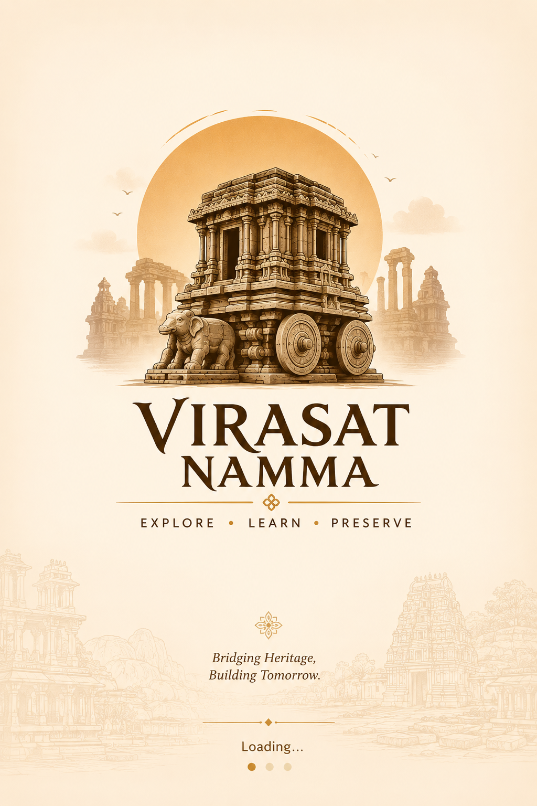

</div>

---

## 🎬 Project Demo

<div align="center">

https://github.com/PREETHAM1590/Virasat-Namma/raw/master/Resources/PROJECT%20DEMO.mp4

</div>

---

## ✨ Features

### 🗺️ Heritage Site Discovery
- Discover heritage sites across Karnataka
- Filter by district, era, and type (temple, inscription, fort)
- View rich site information with curated images

### 🗣️ Bilingual Experience
- Full support for **English** and **Kannada** (ಕನ್ನಡ)
- Seamless language switching without app restart
- Localized content using Android's `strings.xml`

### 📱 QR Code Scanner
- Scan QR codes at heritage sites to unlock **Hidden Facts**
- Powered by **Google ML Kit Barcode Scanning**
- Each site has unique unlockable historical secrets

### 🔊 Audio Guides
- AI-generated narration scripts per heritage site using structured site-context grounding
- Chapter-based audio: Introduction, History, Architecture, Legends, Facts
- Bilingual AI narration (English & Kannada)
- TextToSpeech playback with play/pause controls

### 🤖 AI-Powered Features
- **AI Heritage Chatbot** — Context-aware guide that answers questions about Karnataka's heritage
- **AI Quiz Generator** — Generates site-specific trivia with structured JSON parsing
- **AI Narrated Tours** — Multi-stop guided tours with auto-generated narrations
- **Talking Tours** — Street View + real-time AI narration with multimodal vision analysis
- **AI View Describer** — Describes architectural/historical details of what the user is viewing
- Powered by **AWS Nova** LLM with structured heritage-site context grounding

### 🛂 Digital Travel Passport
- Check-in to visited sites manually or via QR scan
- Persistent storage using **Room Database**
- Track your heritage journey across Karnataka

### 🎨 Beautiful UI
- Temple-inspired theming with warm, heritage colors
- Jetpack Compose declarative UI
- Smooth animations and intuitive navigation

---

## 🏛️ Supported Heritage Sites

| Site Name | District | Type |
|-----------|----------|------|
| 🛕 Belur Chennakeshava Temple | Hassan | Temple |
| 🏰 Hampi Ruins | Ballari | Historical Site |
| 🛕 Virupaksha Temple | Ballari | Temple |
| 🏛️ Mysore Palace | Mysuru | Palace |
| 🗿 Gol Gumbaz | Vijayapura | Monument |
| ⛰️ Badami Caves | Bagalkot | Caves |
| 🦁 Shravanabelagola | Hassan | Jain Heritage |

*...and many more heritage sites across Karnataka!*

---

## 🛠️ Tech Stack

| Layer | Technology | Purpose |
|-------|------------|---------|
| **Language** |  | Primary development language |
| **UI Framework** |  | Modern declarative UI |
| **Architecture** | MVVM + Repository Pattern | Clean, testable code |
| **AI/LLM** |  | AI narration, quiz generation, heritage chatbot |
| **Database** |  | Local data persistence |
| **DI** |  | Dependency injection |
| **QR Scanning** |  | Barcode scanning |
| **Audio** | TextToSpeech | AI-generated audio guide playback |
| **Backend** |  | Auth, Firestore, Storage |
| **Navigation** | Jetpack Navigation | Screen navigation |
| **Async** | Kotlin Coroutines | Asynchronous operations |

---

## 📸 Screenshots

<div align="center">

### English

| Home (1) | Home (2) | Site Detail (1) | Site Detail (2) | Audio Guide |
|----------|----------|-----------------|-----------------|-------------|
| 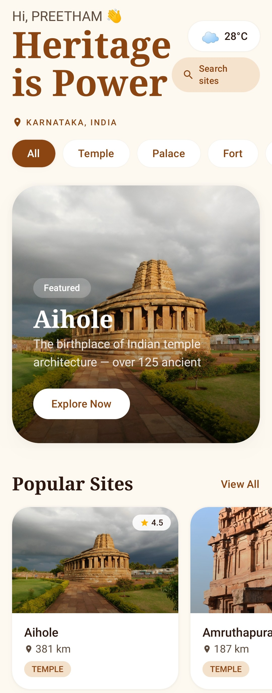 | 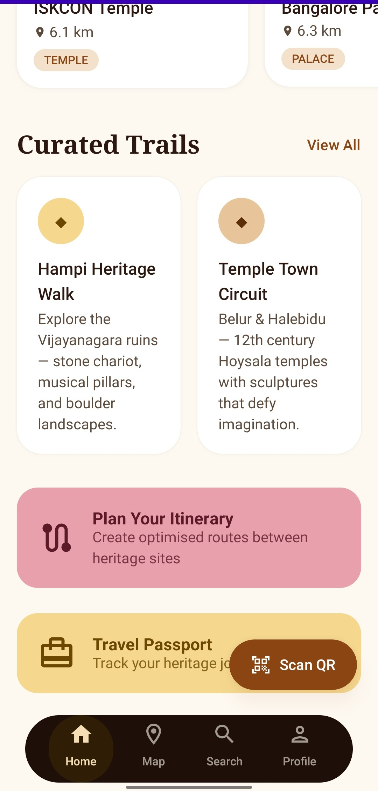 | 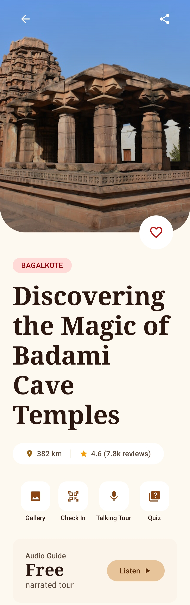 | 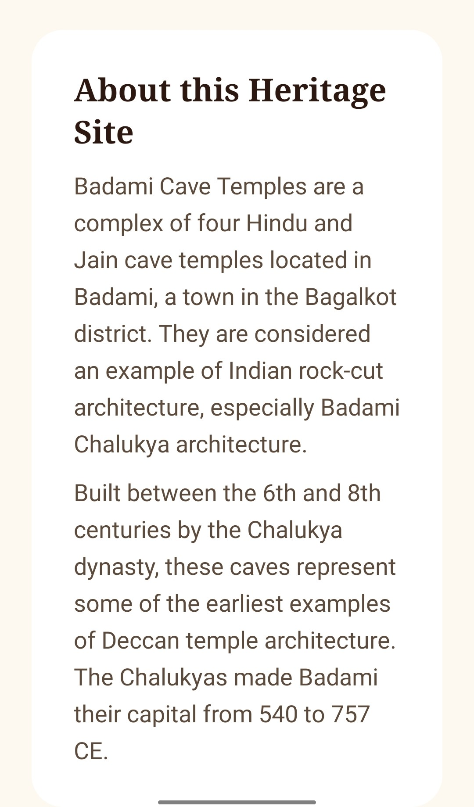 | 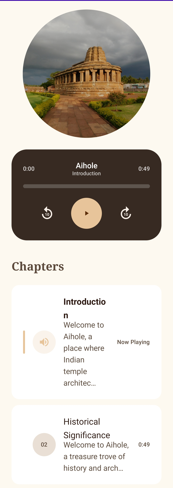 |

| Search | Travel Passport | Profile | Map |
|--------|-----------------|---------|-----|
| 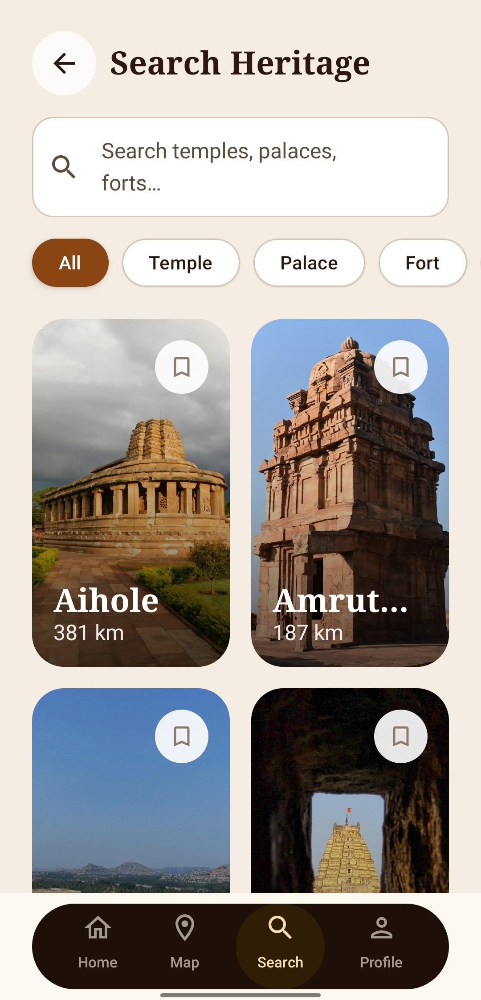 | 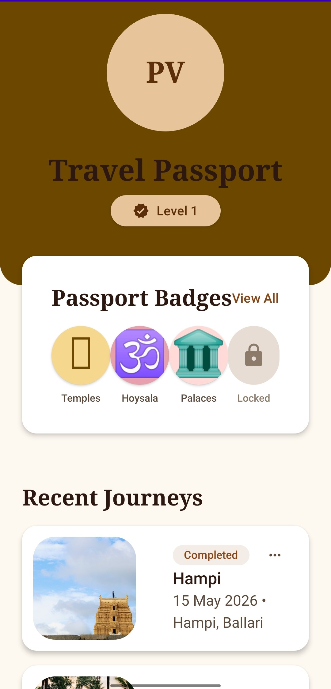 | 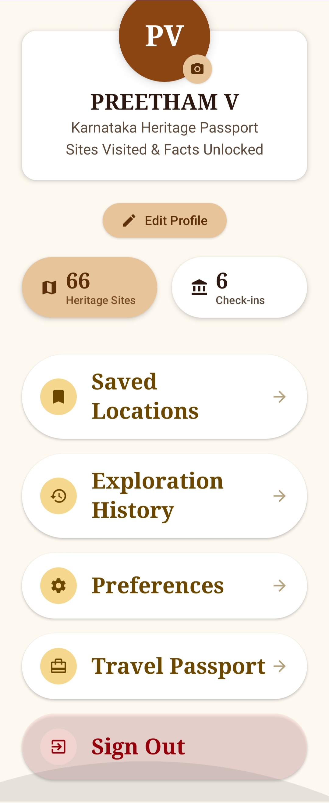 | 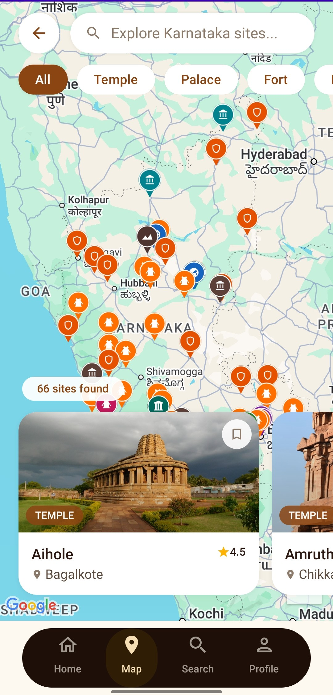 |

### Kannada (ಕನ್ನಡ)

| Home (1) | Home (2) | Site Detail | Audio Guide | Travel Passport |
|----------|----------|-------------|-------------|------------------|
| 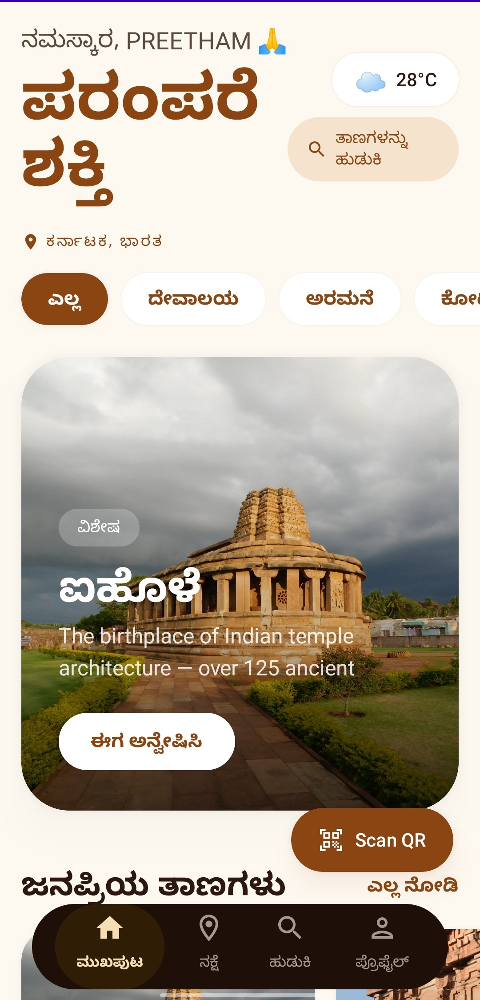 | 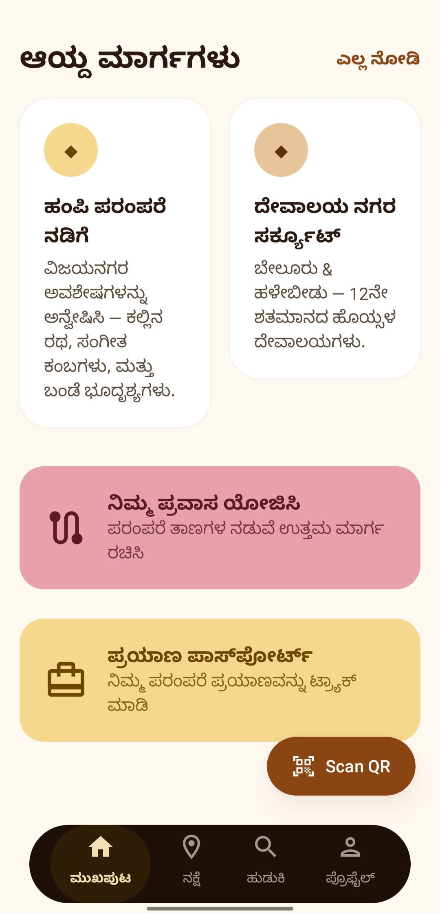 | 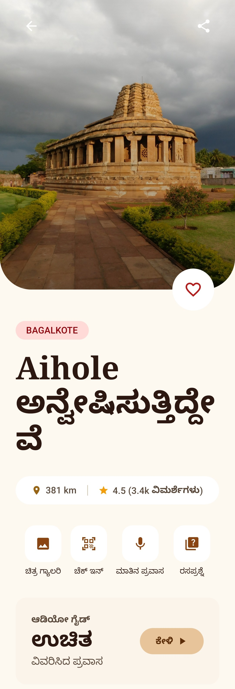 | 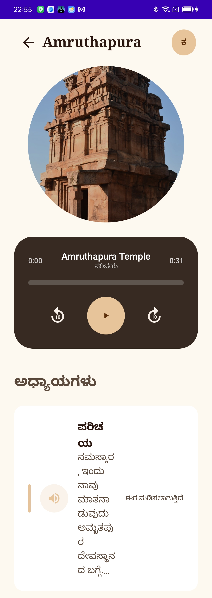 | 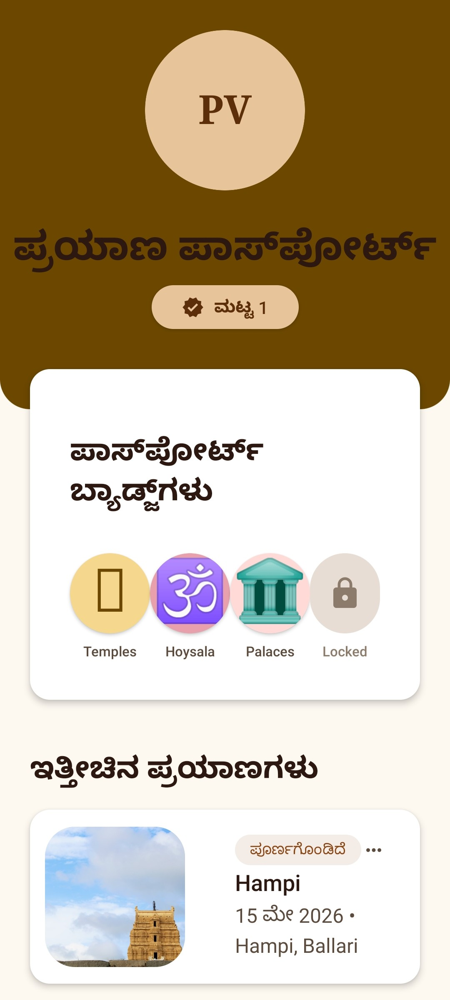 |

| Search | Profile |
|--------|---------|
| 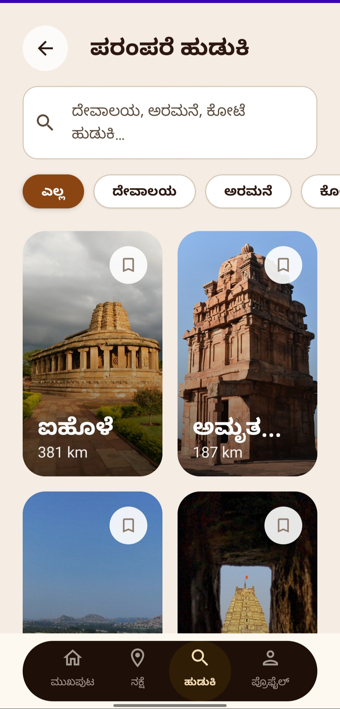 | 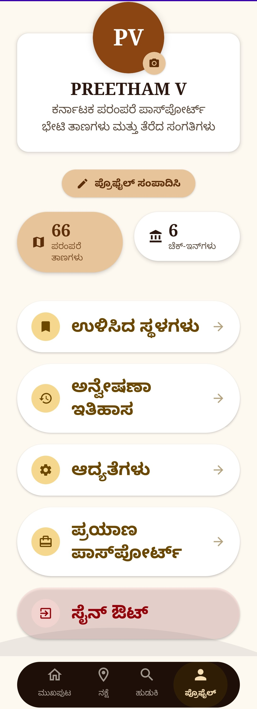 |

</div>

---

## 🚀 Getting Started

### Prerequisites
- **Android Studio** Ladybug or newer
- **JDK 17** or higher
- **Android SDK** 26+ (Android 8.0+)
- **Kotlin** 1.9+

### Installation

1. **Clone the repository**
   ```bash
   git clone https://github.com/PREETHAM1590/Virasat-Namma.git
   cd Virasat-Namma
   ```

2. **Open in Android Studio**
   - Open Android Studio
   - Select "Open an existing project"
   - Choose the `Virasat-Namma` folder

3. **Sync and Build**
   - Let Gradle sync automatically
   - Build the project: `Build → Make Project` (Ctrl+F9)

4. **Run the App**
   - Connect an Android device or start an emulator
   - Click `Run → Run 'app'` (Shift+F10)

### Firebase Setup (Optional)
To use Firebase features (Auth, Firestore, Storage):

1. Create a Firebase project at [firebase.google.com](https://firebase.google.com)
2. Add an Android app with package name: `com.example.virasat`
3. Download `google-services.json` and place it in the `app/` directory
   - A template is provided at `app/google-services.json.template` — copy and fill in your project values
4. Enable Firebase Auth and Firestore in the console

> **Note:** The app builds and runs fully without Firebase. Room Database powers all local persistence (check-ins, unlocked facts, bookmarks). Firebase features (Auth, leaderboard, community) are additive.

### AI / LLM Setup

The AI features (chatbot, quiz generator, audio narration, talking tours) require API keys configured in `local.properties` at the project root:

```properties
# local.properties 
geminiApiKey=your_gemini_api_key_here
mapsApiKey=your_google_maps_api_key_here
deepseekApiKey=your_deepseek_api_key_here
novaApiUrl=https://your-nova-endpoint.amazonaws.com/invoke
novaApiKey=your_nova_api_key_here
```

These are read by `app/build.gradle.kts` and exposed as `BuildConfig` fields. The app compiles without them — AI features will gracefully fall back to static site content.

**Current active backend:** AWS Nova (via `novaApiUrl`). The `geminiApiKey` and `deepseekApiKey` are legacy/fallback options.

> **Production Note:** In a production deployment, API keys should not be bundled in the APK. The planned architecture moves all LLM calls behind a backend proxy (e.g., AWS Lambda or Firebase Cloud Function) so that keys remain server-side and are never exposed to the client.

---

## 📁 Project Structure

```
Virasat-Namma/
├── 📂 app/
│   ├── 📂 src/main/
│   │   ├── 📂 java/com/example/virasat/
│   │   │   ├── 📂 data/           # Data layer (Room, Repositories)
│   │   │   ├── 📂 di/             # Dependency Injection (Hilt)
│   │   │   ├── 📂 domain/         # Business logic (Use Cases)
│   │   │   ├── 📂 ui/             # UI layer (Screens, ViewModels)
│   │   │   │   ├── 📂 screens/    # Compose screens
│   │   │   │   ├── 📂 components/ # Reusable UI components
│   │   │   │   └── 📂 theme/      # Colors, Typography, Theme
│   │   │   └── 📂 utils/          # Utilities and extensions
│   │   ├── 📂 res/                # Resources (strings, images)
│   │   │   ├── 📂 values/         # strings.xml (EN & KN)
│   │   │   └── 📂 drawable/       # Images and assets
│   │   └── 📄 AndroidManifest.xml
│   └── 📄 build.gradle.kts
├── 📂 gradle/
├── 📄 build.gradle.kts            # Project level build
├── 📄 settings.gradle.kts         # Project settings
├── 📄 gradlew / gradlew.bat       # Gradle wrapper
└── 📄 README.md
```

---

## 🗄️ Database Schema

```
┌─────────────────┐     ┌──────────────┐     ┌─────────────────┐
│ HeritageSite    │     │   CheckIn    │     │  UnlockedFact   │
├─────────────────┤     ├──────────────┤     ├─────────────────┤
│ id (PK)         │◄────┤ site_id (FK) │     │ id (PK)         │
│ name            │     │ checkin_date │     │ site_id (FK)    │
│ district        │     │ method       │     │ fact_en         │
│ era             │     └──────────────┘     │ fact_kn         │
│ type            │                          │ unlocked_date   │
│ description_en  │                          └─────────────────┘
│ description_kn  │
│ lat, lng        │
│ image_path      │
│ audio_path      │
└─────────────────┘
```

---

## 🔄 Recent Changes

| Date | Type | Description |
|------|------|-------------|
| 2026-05-21 | 🛡️ Security | Sanitized API service log output to prevent sensitive data leakage via logcat |
| 2026-05-21 | ⚡ Performance | Added stable keys to HomeScreen LazyRow items for efficient Compose recomposition |
| 2026-05-15 | 🚀 Feature | Added LICENSE, wired Travel Passport navigation in Home/Profile screens |

---

## 🎯 Future Enhancements

- [ ] 🌐 **Live GPS Integration** - Real-time nearby site discovery
- [ ] 👥 **Crowdsourced Content** - Submit site stories and images
- [ ] 🔮 **AR Overlays** - Reconstructed views of ruined monuments
- [ ] ☁️ **Cloud Sync** - Cross-device travel passport
- [ ] 🏆 **Gamification** - District completion badges and leaderboard
- [ ] 📶 **Offline-First** - Caching for areas with no connectivity

---

## 📄 License

This project is licensed under the **MIT License** - see the [LICENSE](LICENSE) file for details.

---

## 🙏 Acknowledgements

- **Karnataka Tourism** - For promoting our rich cultural heritage
- **MindMatrix VTU Internship Program** - For the project opportunity
- **Google ML Kit** - For powerful on-device ML capabilities
- **Jetpack Compose** - For modern Android UI toolkit
- **Firebase** - For backend services

---

<div align="center">

## 👨‍💻 Maintainer

**PREETHAM1590**

[](https://github.com/PREETHAM1590)

---

### 🙏 *ಧನ್ಯವಾದಗಳು | Thank You*

**Made with ❤️ and ☕ in Karnataka, India**

*ಜೈ ಕರ್ನಾಟಕ | Jai Karnataka* 🚩

</div>
