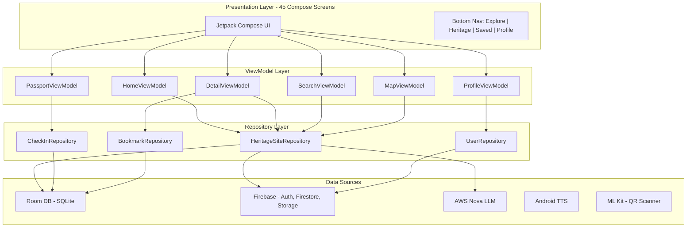
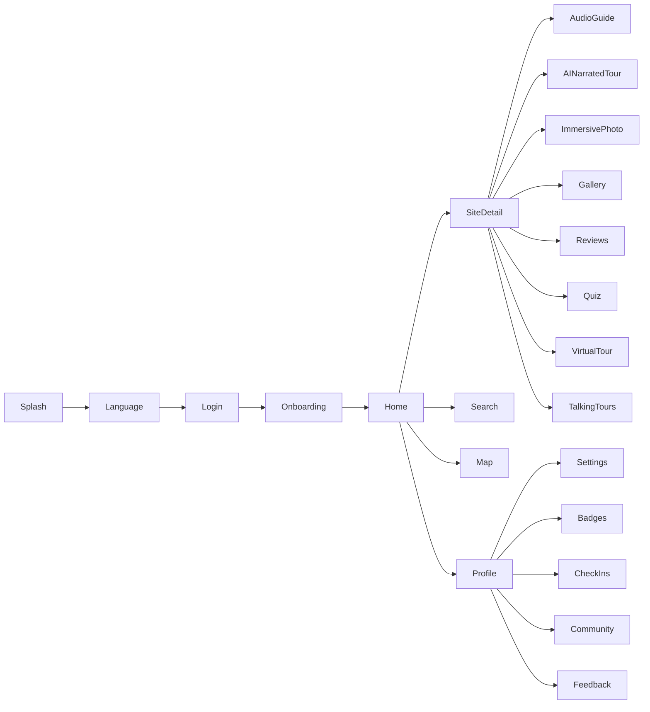
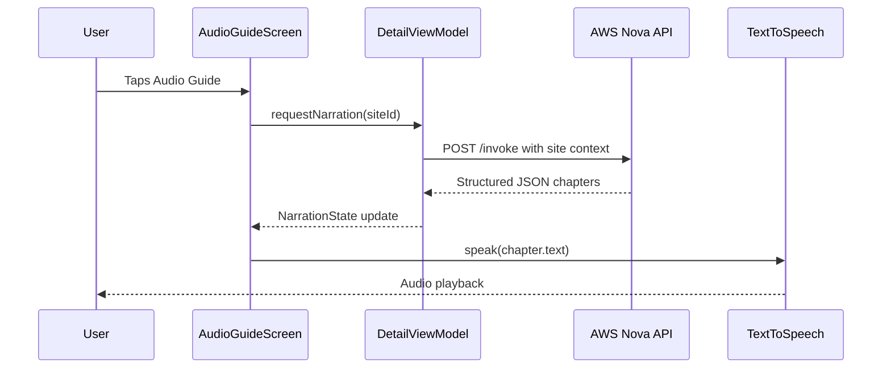
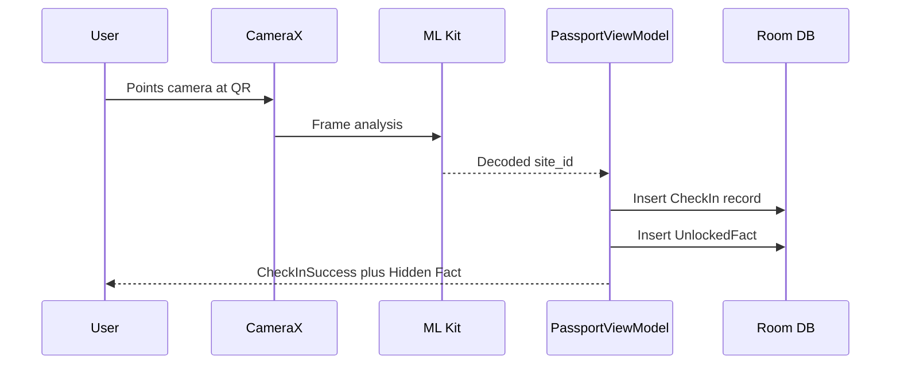
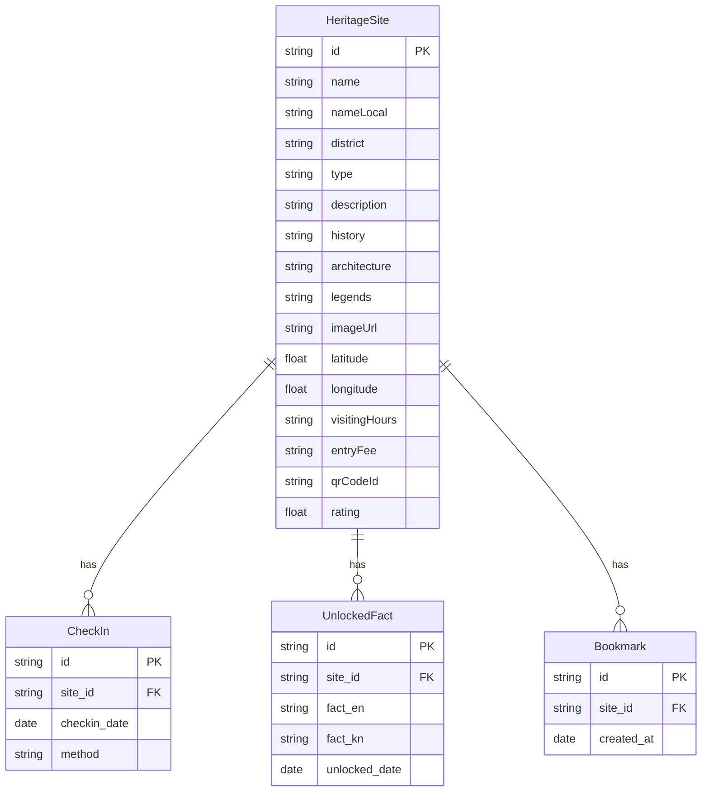
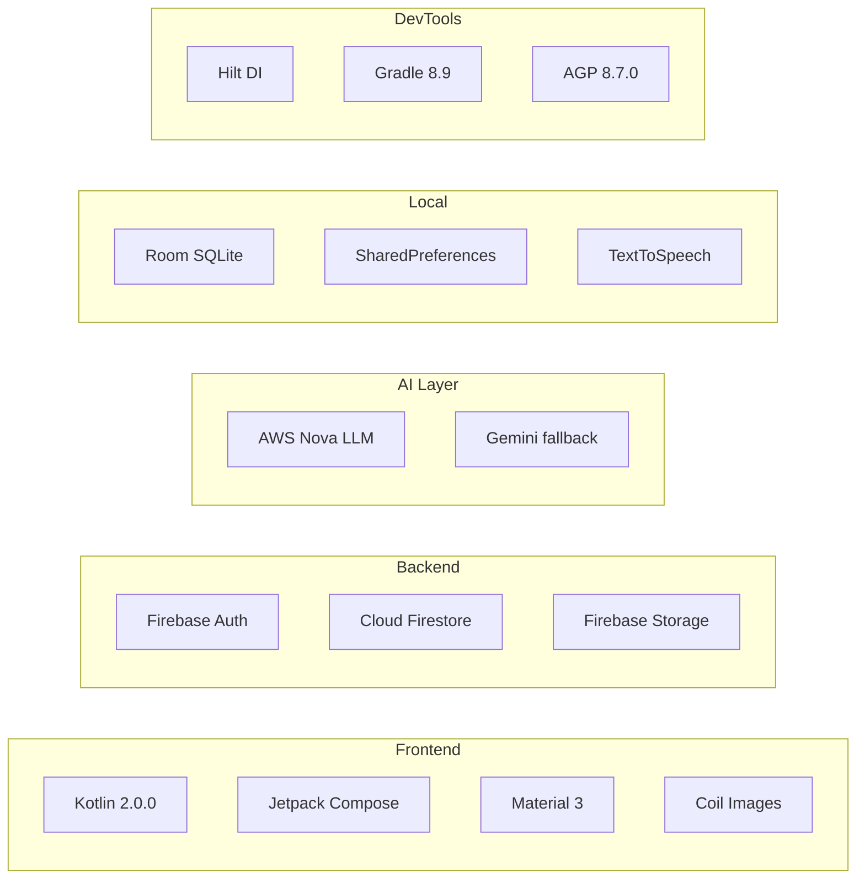

# Virasat-Namma — Architecture Design

## High-Level Architecture Diagram



## Navigation Flow



## Data Flow - AI Narration



## Data Flow - QR Check-in



## Database Schema



## Tech Stack



## Module Structure

```
app/src/main/java/com/example/virasat/
├── data/
│   ├── db/               # Room database, DAOs, entities
│   ├── di/               # Hilt modules (RepositoryProvider)
│   ├── repository/       # Repository implementations
│   ├── service/          # API services (Weather, AI)
│   └── source/           # Static data (KarnatakaSites.kt - 59 sites)
├── di/                    # App-level DI modules
├── domain/                # Business logic / Use cases
├── ui/
│   ├── components/       # Reusable Compose components
│   ├── screens/          # 45 screen composables
│   └── theme/            # Colors, Typography, Shapes
├── viewmodel/            # 6 ViewModels
├── utils/                # Extensions, helpers
└── MainActivity.kt       # NavHost, auth state, routes
```

## Color System

| Token | Hex | Usage |
|-------|-----|-------|
| Primary | #556500 | Buttons, active states |
| PrimaryContainer | #B7D23F | Cards, highlights |
| Background | #F9FAF5 | Screen backgrounds |
| Surface | #F9FAF5 | Elevated surfaces |
| NavBackground | #0B2211 | Bottom navigation |

## Screens (45 Total)

| Category | Screens |
|----------|---------|
| Onboarding | Splash, Language, Onboarding, Login, SignUp, ForgotPassword |
| Core | Home, Search, Map, SiteDetail, PopularSites, HeritageSitesList |
| AI Features | AudioGuide, AINarratedTour, AIAssistant, Quiz, TalkingTours, VirtualTour |
| Media | ImageGallery, ImmersivePhoto, Reviews |
| Passport | TravelPassport, CheckInSuccess, MyCheckIns, Badges |
| Social | Community, Leaderboard, Bookmarked |
| Profile | Profile, Settings, Notifications, HeritageGuides, Itinerary |
| Support | HelpSupport, ContactUs, Feedback, About, PrivacyPolicy, TermsOfService |
| System | EmptyState, Error, Offline, Permission, DataSync |
